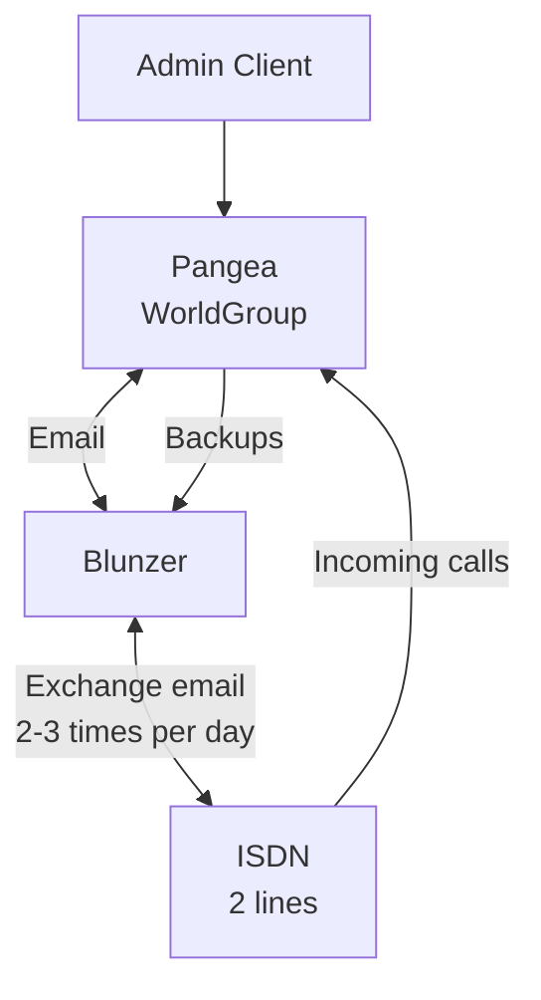

# Pangea 2023

Running Pangea in 2023 

## What is?

This is how the system used to work between 1996 and 1999:

## Contents

To run this repo, you need it plus the following files that cannot be distribuited:

- tightvnc
- pangea.disk
- win95.img (making two copies: win95a.img and win95b.img)

Other prerequisites

- qemu-386 (see `server_setup.md`)
- java
- telnet

### Gallery

Accessing the BBS through the Windows client:

Admin panel + user logged in:

The version of Worldgroup installed, as it appears on the client's admin panel:

Accessing the BBS in Telnet mode:

### Pangea

This is Wordgroup 2 server running on DOS, over a network. It is already correctly licensed for 5 channels (!).
It mostly works, apart from the fact that it expects dates in "1999" to be higher than "2023", so e.g. the
system log is unreadable, and some notifications are broken.

You need to run this script as `sudo ./pangy.sh`, as it has to bind to port 23.

This is a 128mb PC with a ne2000-pci card. Installed with MS DOS 6.22.

We forward ports 23 (for remote access) and 80 (but it does not seem to work with our version of Worldgroup).

When it starts, you have to type:

	wg

And then select "Go!"

From the host, you can acces Pangea via:

	telnet 127.0.0.1 23

Logins were usually of the form "name surname". User names and passwords are in cleartext.

The server has a number of partitions:

- c   - system - primary, startable, 500
- d    (cdrom) 100
- e    
- f    
- g  backup? 240
- h  (used to be a second copy of backups to Blunzer mounted over SMB)

### Win95

The VM for Windows 95, that can be run from the command `./win95.sh`, is accessible over VNC at port 5901.

The Worldgroup client is already installed, as well as telnet.

You can also connect to Pangea over telnet by opening CMD and calling:

	telnet 10.0.2.2 

This is a 64-Mb Pentium with a ne2000 card running WIndows 95 OSR 2.  TCP-IP and DNS are working, though with the severely limited QEMU "user" newtwork (see below).

The Wordgroup client requires Windos 95 - text input widgets don't work correctly on Windows 98. It was installed
following the tutorial at https://computernewb.com/wiki/QEMU/Guests/Windows_95 - it is fun how the ISO and the
Windows license key can be downloaded freely. 

By duplicating this script, and the disk, we can show how  multi-user works.

### Remote forwardings

You can use

	ssh -L 10023:localhost:23 -L 5902:localhost:5902 -L 5901:localhost:5901 -L 5900:localhost:5900 marcopilter

To forward:

- Port 23 (for telnet access to Pangea, locally available as port 10023)
- Port 5900 (VNC for Pangea - Worldgroup server)
- Port 5901 (VNC for Win95)
- Port 5902 (VNC for a second instance of Win95)

I have seen that ThightVNC works well (or at least works...) and you can run it by issuing:

	java -jar tightvnc-jviewer.jar

### Notes on Qemu emulation

When running through VNC, you can switch to the QEMU configuration shell to mount disks
by pressing Ctrl-Alt-2 (and Ctrl-Alt-1 to go back to the main emulation screen).

Some commands you can use:

	change ide1-cd0 filename.iso
	eject ide1-cd0
	info pci

When looking at some long output, you can scroll back using Shift-Ctrl-cursor.

You can copy arbitrary files to a "virtual" CDROM and then mount it on your guest:

	hdiutil makehybrid -iso -joliet -o my_cdr.iso my_folder

All machines use the QEMU "user" network. This basically nats the guest, and exposes the host's
DNS on 10.0.2.7. All ports on 10.0.2.2 are mapped to the host. See https://wiki.qemu.org/Documentation/Networking#User_Networking_(SLIRP) for reference.

You can forward some port from the guest to the host, and that's what we do with Pangea -
we run the server, expose its port 23 on port 23 of the host, and then connect from 
Win95 to  10.0.2.2:23 in oder to reach the host, and thence Pangea. 
 

## In practice

- Go to the main folder
- Open "screen"
- In one screen run "sudo ./pangy.sh"
- In another one run "./win95a.sh"
- In another one run "./win95b.sh"
- Then start two copies of tightvnc

